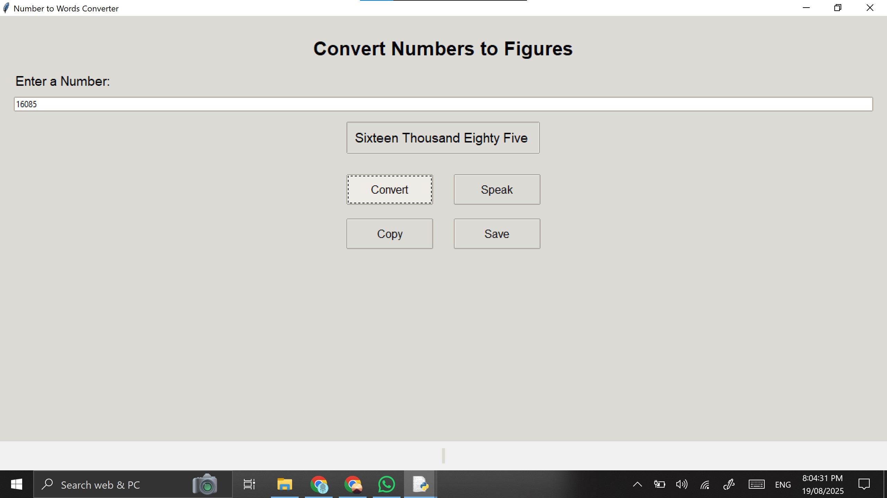

# NumberSpeak

A Python desktop application that converts numbers into words (up to 15 digits) and provides **text-to-speech output**.

## Features
- Convert numbers to words instantly.
- Speak numbers using text-to-speech (pyttsx3).
- Copy results to clipboard or save to file.
- User-friendly, resizable GUI built with Tkinter.
- Handles numbers up to 15 digits accurately.

## Technologies Used
- Python 3
- Tkinter (GUI)
- pyttsx3 (Text-to-Speech)

## Installation 
1. Clone the repository:
git clone <repository_url>

2. Navigate to the folder:
cd numberspeak

3. Install dependencies:
pip install pyttsx3

4. Run the application:
python numberspeak.py

## Usage
1. Enter a number in the input field.

2. Click Convert to see it in words.

3. Click Speak to hear it.

4. Use Copy to copy result or Save to write to a file.

## Screenshots

## Contributing

Contributions are welcome! Please submit issues or pull requests for improvements.
